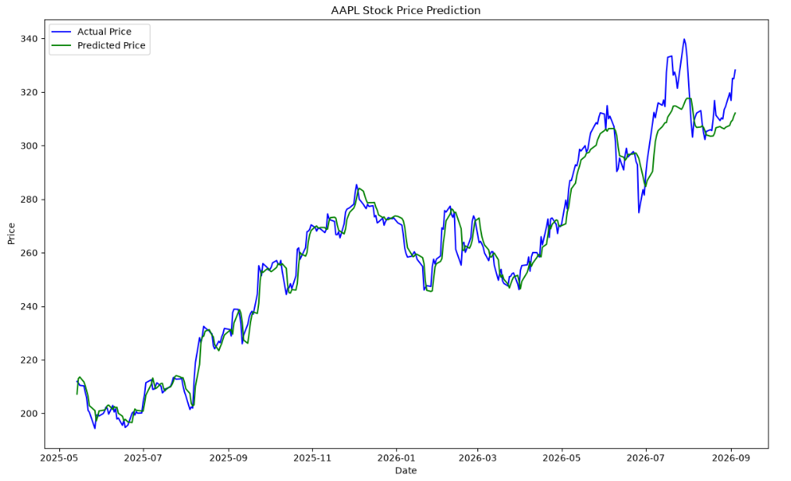

# Stock Price Prediction with LSTM (PyTorch)

A hands-on deep learning project that explores historical stock data and builds an LSTM (Long Short-Term Memory) neural network in PyTorch to predict next-day closing prices, using Apple (AAPL) as the primary case study.



## 🎯 Project Goal

Learn how to build a stock price prediction model using an LSTM neural network in PyTorch. This project practices the full pipeline — pulling data, preprocessing/scaling it, exploratory analysis, building and training an LSTM model, and evaluating its predictions — as a foundation for time series forecasting and stock analysis skills.

## 📊 What This Project Covers

1. **Exploratory Stock Analysis** — comparing AAPL, GOOG, MSFT, and AMZN across:
   - Closing price trends over time
   - Trading volume patterns
   - Moving averages (10/20/50-day)
   - Daily returns and volatility
   - Cross-stock correlation
   - Risk vs. expected return
2. **Data Preprocessing** — scaling closing prices and building sliding-window sequences
3. **LSTM Model (PyTorch)** — a custom `nn.Module` with an LSTM layer + linear output layer
4. **Training & Evaluation** — training loop with MSE loss and Adam optimizer, evaluated using RMSE
5. **Visualization** — actual vs. predicted price charts and prediction error over time

## 🛠️ Tech Stack

- Python
- PyTorch
- pandas / NumPy
- yfinance (data source)
- scikit-learn (scaling, metrics)
- matplotlib / seaborn (visualization)

## 📁 Project Structure

```
├── Stock_Price_Prediction_with_LSTM_(PyTorch).ipynb   # Main notebook
├── README.md
└── .gitignore
```

## 🚀 Getting Started

1. Clone this repo:
   ```bash
   git clone <your-repo-url>
   cd stock-price-prediction-lstm
   ```
2. Install dependencies:
   ```bash
   pip install numpy pandas yfinance matplotlib seaborn torch scikit-learn
   ```
3. Open the notebook:
   ```bash
   jupyter lab
   ```

## 📈 Results

- **Train RMSE:** ~$3.17
- **Test RMSE:** ~$6.03

The model closely tracks actual price movement during stable, gradually trending periods, but lags behind during sudden, sharp price surges — a common limitation of pattern-based time series models when faced with unprecedented market behavior.

## ⚠️ Disclaimer

This project is for **educational purposes only**. It is not financial advice, and the model should not be used to make real investment or trading decisions. Stock prices are highly influenced by unpredictable, real-world factors that historical price patterns alone cannot capture.

## 📚 Acknowledgements

Built while learning from NeuralNine's PyTorch LSTM tutorial and incorporating exploratory analysis techniques inspired by the "Stock Market Analysis + Prediction using LSTM" Kaggle notebook by Fares Sayah.
